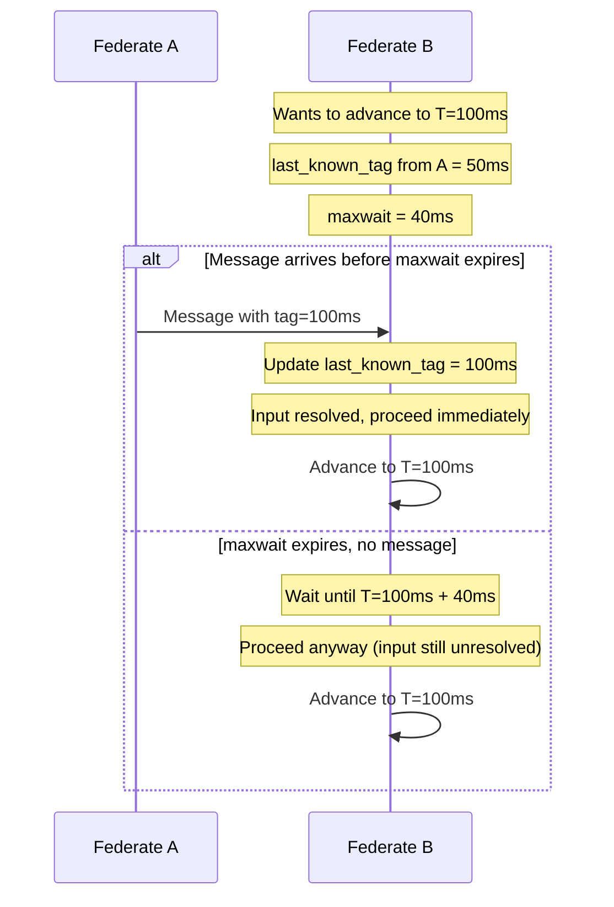
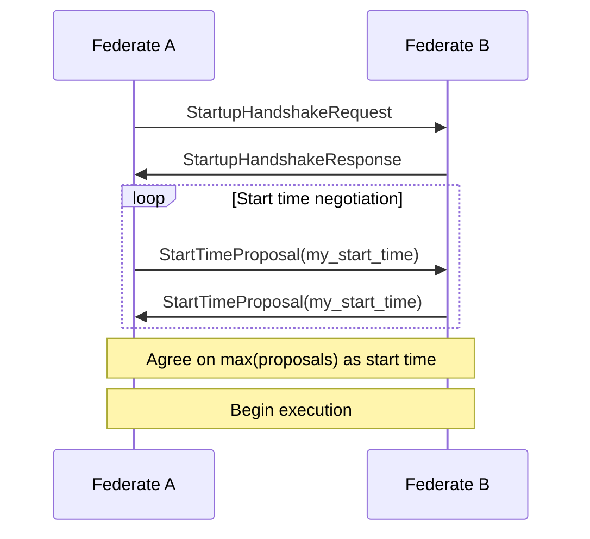
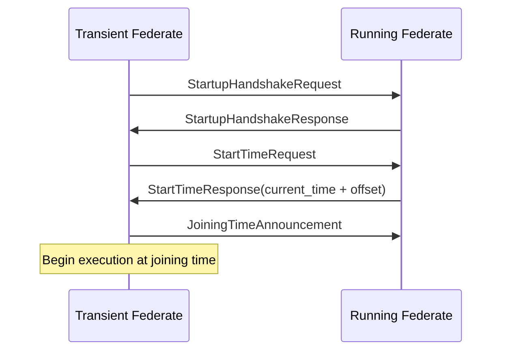
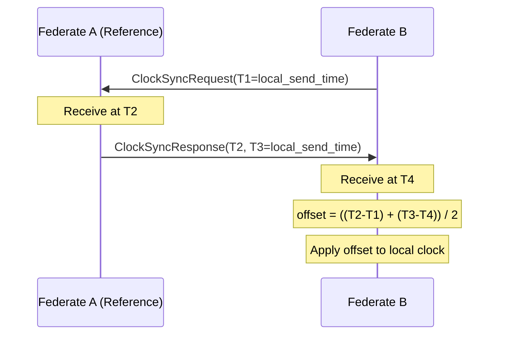

# Federated Execution

**Federation** enables reactor programs to run across multiple nodes connected by a network. Each node runs a **federate**—an independent process executing part of the reactor program. reactor-uc maintains determinism guarantees across the distributed system through careful coordination.

## Why Federation?

Distributed execution is essential for:

- **Cyber-physical systems**: Sensors and actuators are physically distributed
- **Scalability**: Workloads too large for a single MCU
- **Fault tolerance**: Redundant nodes for reliability
- **Mixed platforms**: Different MCUs for different tasks

The challenge: how do you maintain the reactor model's determinism when reactors communicate over unpredictable networks?

## Architecture Overview

A federated reactor program consists of:

<p align="center">
  
</p>

Each federate:

- Runs its own scheduler and event queue
- Maintains its own logical time
- Communicates via **network channels**
- Coordinates startup and timing

## Network Channels

A **network channel** represents a physical transport connection between two federates (e.g., a TCP/IP socket, a UART link, or a CoAP endpoint). Multiple LF connections can be multiplexed over a single network channel via [Connection Bundles](#connection-bundles).

Network channels abstract the underlying transport:

```c
typedef enum {
  NETWORK_CHANNEL_TYPE_TCP_IP,
  NETWORK_CHANNEL_TYPE_UART,
  NETWORK_CHANNEL_TYPE_COAP_UDP,
  // ... platform-specific
} NetworkChannelType;

struct NetworkChannel {
  NetworkChannelType type;
  bool (*open)(NetworkChannel* self);
  void (*close)(NetworkChannel* self);
  lf_ret_t (*send)(NetworkChannel* self, const FederatedMessage* msg);
  lf_ret_t (*recv)(NetworkChannel* self, FederatedMessage* msg);
  bool (*is_connected)(NetworkChannel* self);
};
```

### Supported Transports

| Transport | Platforms | Use Case |
|-----------|-----------|----------|
| TCP/IP | POSIX, Zephyr, RIOT | Ethernet, WiFi |
| UART | RIOT, Pico | Point-to-point serial |
| CoAP/UDP | RIOT | IoT networks |
| Custom | Any | Specialized hardware |

### Channel Modes

**Polled mode**: The scheduler explicitly polls for messages:

```c
// In acquire_tag()
while (!can_advance(tag)) {
  channel->recv(&msg);
  process_message(&msg);
}
```

**Async mode**: Messages arrive via callbacks:

```c
// Callback registered with network stack
void on_message_received(FederatedMessage* msg) {
  queue_incoming_message(msg);
  platform->notify();  // Wake scheduler
}
```

## Connection Bundles

Multiple **LF connections** (logical connections between reactor ports) can be multiplexed over a single **network channel** (e.g., one TCP/IP socket). Connection bundles group these LF connections together:

```c
struct FederatedConnectionBundle {
  NetworkChannel* net_channel;          // Single network channel (e.g., TCP socket)
  FederatedInputConnection** inputs;    // LF connections receiving data
  size_t inputs_size;
  FederatedOutputConnection** outputs;  // LF connections sending data
  size_t outputs_size;
  serialize_hook* serialize_hooks;
  deserialize_hook* deserialize_hooks;
};
```

Each bundle:

- Uses **one network channel** for transport (TCP/IP socket, UART link, CoAP endpoint, etc.)
- Contains **multiple LF connections** that share this channel
- Handles serialization/deserialization for each LF connection

This multiplexing reduces the number of physical network connections needed between federates.

## Federated LF Connections

LF connections that cross federate boundaries are represented as `FederatedInputConnection` and `FederatedOutputConnection` objects.

### Federated Input Connection

Represents an LF input port receiving data from a remote federate:

```c
struct FederatedInputConnection {
  Connection super;
  MUTEX_T mutex;            // Protects concurrent access
  interval_t delay;         // Logical delay on the LF connection
  tag_t last_known_tag;     // Latest tag received from upstream
  interval_t max_wait;      // @maxwait value for this LF connection
};
```

### Federated Output Connection

Represents an LF output port sending data to a remote federate:

```c
struct FederatedOutputConnection {
  Connection super;
  FederatedFlushReactor flush_reactor;  // fluhes outgoing messages
};
```

The **flush reactor** ensures messages are sent at the earliest possible time, reducing network congestion and enabling real-time applications.

## Message Format

Messages use Protocol Buffers (nanopb) for efficient serialization:

```protobuf
message TaggedMessage {
  required Tag tag = 1;
  required int32 conn_id = 2;  // Identifies which LF connection
  required bytes payload = 3 [(nanopb).max_size = 832];
}

message Tag {
  required int64 time = 1;
  required uint32 microstep = 2;
}
```

The `conn_id` identifies which LF connection the message belongs to, enabling multiplexing of multiple LF connections over a single network channel.

## Tag Acquisition and @maxwait

The core coordination challenge in federated execution: when can a federate safely advance its logical time?

**Problem**: A federate at tag T doesn't know if a message with a smaller tag will arrive from an upstream federate.

**Solution**: The **`@maxwait`** annotation controls how long a federate waits for messages from one neighboring federates before advancing to a new tag.

For detailed annotation syntax, see the [Annotations Reference](../documentation/annotations.md#network-configuration).

### How @maxwait Works

Before advancing to a tag, the scheduler checks each federated input connection:

1. If `last_known_tag >= next_tag`, the input is **resolved** - proceed immediately
2. If `last_known_tag < next_tag`, the input is **unresolved** - wait up to `max_wait`

```c
// In FederatedEnvironment_acquire_tag()
for each input connection:
    if (last_known_tag < next_tag) {
        // Input is unresolved, need to wait
        additional_sleep = max(additional_sleep, input->max_wait);
    }

if (additional_sleep > 0) {
    wait_until(next_tag.time + additional_sleep);
}
// If sleep is interrupted for example by an incoming message start from the beginning
```

If a message arrives during the wait, it updates `last_known_tag` and may allow the federate to proceed early.



### Applying @maxwait to Federates

When applied to a federate instantiation, `@maxwait` sets the **baseline** wait time for all incoming connections:

```lf
federated reactor {
  r1 = new Src()
  @maxwait(0)  // Federate r2 has zero baseline wait time
  r2 = new Dst()
  r1.out -> r2.in
}
```

### Applying @maxwait to Connections

For finer control, apply `@maxwait` to individual connections to override the baseline:

```lf
federated reactor {
  r1 = new Src(sleep = 0 msec)
  r2 = new Src(sleep = 1 sec)
  @maxwait(0)        // Baseline maxwait for r3 is zero
  r3 = new Dst()
  @maxwait(forever)  // Override: wait indefinitely for r3.in1
  r1.out -> r3.in1
  @maxwait(100 ms)   // Override: wait up to 100ms for r3.in2
  r2.out -> r3.in2
}
```

### @maxwait Values

| Value | Behavior |
|-------|----------|
| `0` | No waiting; advance immediately regardless of unresolved inputs |
| `<time>` | Wait up to the specified duration (e.g., `100 ms`, `1 sec`) |
| `forever` | Wait indefinitely until a message arrives for the tag |

## Safe-To-Process (STP) Violations

An **STP violation** occurs when a message arrives for a tag that has **already been processed**. This is different from `@maxwait` - the message arrived, but it arrived too late.

### When STP Violations Occur

1. Federate B advances to tag T and processes reactions
2. Later, a message from Federate A arrives with intended tag T (or earlier)
3. The scheduler detects that the message's intended tag is in the past
4. This is an STP violation - the message should have been processed at tag T but wasn't

```c
// In Scheduler_schedule_at()
if (lf_tag_compare(event->tag, current_tag) <= 0) {
    return LF_PAST_TAG;  // STP violation!
}

// In FederatedConnectionBundle_handle_tagged_msg()
case LF_PAST_TAG:
    LF_INFO(FED, "Safe-to-process violation! Scheduling at current tag instead.");
    event.tag = current_tag;
    event.tag.microstep++;
    schedule_at(&event);
```

### Handling STP Violations with tardy

Reactions can detect and handle STP violations using the `tardy` clause:

```lf
reactor Dst {
  input in: int

  reaction(in) {=
    // Normal handling - message arrived on time
    printf("Received on time: %d\n", in->value);
  =} tardy {=
    // STP violation - message arrived late
    printf("Late message received!\n");
    // Take corrective action: use default value, log, etc.
  =}
}
```

The scheduler checks each reaction before execution:

```c
// In _Scheduler_check_and_handle_stp_violations()
if (port->intended_tag != current_tag) {
    // The port's value was intended for a different tag
    reaction->stp_violation_handler(reaction);  // Call tardy handler
    return true;  // Skip normal reaction body
}
```

## Startup Coordination

Before execution begins, all federates must agree on a federation start time:



### Handshake Protocol

1. **Connection establishment**: TCP/UART connections opened
2. **Handshake**: Exchange version and configuration info
3. **Start time negotiation**: Agree on a common start time
4. **Barrier**: All federates wait until agreed time
5. **Begin**: Execution starts at agreed time

## Transient Federates

**Transient federates** can join a running federation dynamically:



The primariy use-case if for letting failed or crashed federates to join back
into the federation. But also other patterns could be realized with this mechanism.

## Clock Synchronization

Physical clocks on different nodes, especially microcontrollers, drift and are not synchronized. reactor-uc can synchronize them.

```c
struct ClockSyncService {
  instant_t offset;      // Local clock offset from reference
  instant_t uncertainty; // Synchronization uncertainty

  void (*sync)(ClockSyncService* self);
  instant_t (*adjust)(ClockSyncService* self, instant_t local_time);
};
```

### Synchronization Protocol



### When to Use

- **Required**: When STP bounds are tight relative to clock drift
- **Optional**: When physical timing is loose or nodes share a clock source
- **Disabled**: For testing or when using logical time only

## Federated Environment

The **federated environment** extends the base environment:

```c
struct FederatedEnvironment {
  Environment super;
  FederatedConnectionBundle** bundles;
  size_t bundles_size;
  StartupCoordinator* startup_coordinator;
  ClockSyncService* clock_sync;

  lf_ret_t (*acquire_tag)(FederatedEnvironment* self, tag_t tag);
  void (*send_messages)(FederatedEnvironment* self);
};
```

The `acquire_tag` function implements the `@maxwait` mechanism, potentially waiting for unresolved federated inputs before advancing to the requested tag.

## Example: Two-Federate System

<p align="center">
  
</p>

Configuration:

```lf
federated reactor System {
  a = new Sensor() at FederateA;
  b = new Actuator() at FederateB;

  a.out -> b.in after 10ms;  // 10ms network delay budget
}
```

## Configuring Network Interfaces

Federates communicate through **network channels** derived from interface annotations. The configuration involves two steps:

1. **Define interfaces** on each federate using `@interface_*` annotations - these are translated by the code generator into network channels
2. **Bind connections** to interfaces using `@link` - this tells the code generator which network channel should carry each LF connection

For the complete list of interface annotations, see the [Annotations Reference](../documentation/annotations.md#network-interfaces).

### @interface_* Annotations

Each `@interface_*` annotation defines a named network interface on a federate. The annotation is placed before the federate instantiation:

```lf
@interface_tcp(name="net0", address="192.168.1.10")
r1 = new Sensor()
```

Available interface types:

| Annotation | Use Case |
|------------|----------|
| `@interface_tcp` | TCP/IP over Ethernet or WiFi |
| `@interface_uart` | Serial communication |
| `@interface_coap` | CoAP/UDP for IoT networks |
| `@interface_s4noc` | Network-on-chip for Patmos |
| `@interface_custom` | User-defined protocols |

### @link Annotation

The `@link` annotation binds an LF connection to specific network interfaces. It specifies which interface on the sender (`left`) and receiver (`right`) should be used:

```lf
@link(left="net0", right="net0")
r1.out -> r2.in
```

### TCP/IP Example

```lf
federated reactor {
  // Define TCP interface on sender federate
  @interface_tcp(name="if1", address="127.0.0.1")
  r1 = new Src()

  // Define TCP interface on receiver federate
  @interface_tcp(name="if1", address="127.0.0.1")
  r2 = new Dst()

  // Bind LF connection to network interfaces (r2 acts as TCP server on port 1042)
  @link(left="if1", right="if1", server_side="right", server_port=1042)
  r1.out -> r2.in  // This LF connection will use the TCP channel
}
```

### CoAP/UDP Example

For IoT networks with constrained devices:

```lf
federated reactor {
  @interface_coap(name="if1", address="fe80::44e5:1bff:fee4:dac8")
  r1 = new Src()

  @interface_coap(name="if1", address="fe80::8cc3:33ff:febb:1b3")
  r2 = new Dst()

  @link(left="if1", right="if1")
  r1.out -> r2.in
}
```

### Custom Interface Example

For specialized hardware or protocols:

```lf
federated reactor {
  @interface_custom(name="MyInterface", include="my_interface.h", args="1")
  r1 = new Src()

  @interface_custom(name="MyInterface", include="my_interface.h", args="2")
  r2 = new Dst()

  r1.out -> r2.in
}
```

## Best Practices

### @maxwait Tuning

- Set `@maxwait` slightly larger than worst-case network latency
- Too small: risk of STP violations when messages arrive late
- Too large: unnecessary waiting before advancing tags
- Use `@maxwait(forever)` only when messages are guaranteed to arrive
- Use `@maxwait(0)` for non-critical inputs where occasional late messages are acceptable

### Handling Late Messages

- Always implement `tardy` handlers for reactions on federated inputs
- In `tardy` handlers: log violations, use default values, or trigger recovery
- Consider whether a late message should be processed or dropped

### Network Reliability

- TCP for reliable delivery
- UDP/CoAP for low-latency with application-level acks
- UART for simple point-to-point

### Error Handling

- Implement reconnection logic
- Handle message loss gracefully
- Log violations for debugging
- Use `tardy` handlers to gracefully degrade under network failures

