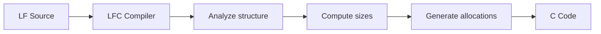

# Memory Management

Embedded systems have strict memory constraints. reactor-uc uses a **pre-allocation strategy** that allocates all memory at startup, ensuring predictable behavior and avoiding the pitfalls of dynamic allocation.

## Why No Runtime Allocation?

Dynamic memory allocation (`malloc`/`free`) is problematic for embedded systems:

- **Fragmentation**: Repeated allocations create unusable memory holes
- **Non-deterministic timing**: Allocation time varies unpredictably
- **Exhaustion risk**: Out-of-memory errors are hard to handle gracefully
- **Debugging difficulty**: Memory leaks and corruption are hard to trace

reactor-uc avoids these issues by allocating all memory at startup, before the reactor program begins executing.

## Pre-allocation Strategy

All reactor-uc data structures are sized at compile time:

```c
// Generated code allocates fixed-size arrays
Reaction* reactions[MAX_REACTIONS];
Trigger* triggers[MAX_TRIGGERS];
Event event_buffer[MAX_PENDING_EVENTS];
```

The Lingua Franca compiler analyzes the program structure and generates appropriately sized allocations:



### What Gets Pre-allocated

| Structure | Sizing Basis |
|-----------|--------------|
| Reactors | Number of reactor instances |
| Reactions | Reactions per reactor |
| Ports | Ports per reactor |
| Connections | Connection count in model |
| Event queue | Max pending events (configurable) |
| Payload pools | Actions × max pending per action |

## Event Payload Pools

**Actions** need to store payloads for pending events. Since multiple events can be pending simultaneously, reactor-uc uses **payload pools**:

```c
typedef struct {
  void* buffer;           // Pre-allocated payload storage
  size_t payload_size;    // Size of each payload
  size_t capacity;        // Number of slots
  bool* used;             // Which slots are in use
  size_t available;       // Count of free slots
  MUTEX_T mutex;          // Concurrent access protection
} EventPayloadPool;
```

### Pool Operations

**Allocate** a payload slot when scheduling an action:

```c
void* EventPayloadPool_allocate(EventPayloadPool* self) {
  MUTEX_LOCK(self->mutex);
  for (size_t i = 0; i < self->capacity; i++) {
    if (!self->used[i]) {
      self->used[i] = true;
      self->available--;
      MUTEX_UNLOCK(self->mutex);
      return self->buffer + (i * self->payload_size);
    }
  }
  MUTEX_UNLOCK(self->mutex);
  return NULL;  // Pool exhausted
}
```

**Free** a payload slot when the event is processed:

```c
void EventPayloadPool_free(EventPayloadPool* self, void* payload) {
  size_t index = (payload - self->buffer) / self->payload_size;
  MUTEX_LOCK(self->mutex);
  self->used[index] = false;
  self->available++;
  MUTEX_UNLOCK(self->mutex);
}
```

### Pool Sizing

The pool capacity is determined by:

1. `max_pending_events` annotation on the action
2. Worst-case analysis of scheduling patterns
3. Default conservative values

```lf
// In Lingua Franca source:
logical action a: int {= max_pending = 5 =}
```

This generates a pool with 5 slots for action `a`.

## Stack vs Heap Allocation

reactor-uc supports both allocation strategies:

### Stack Allocation (Default)

Reactor structures are allocated on the stack in the generated `main()` function:

```c
int main(void) {
  // Stack-allocated reactors
  MyReactor reactor1;
  MyReactor reactor2;

  // Stack-allocated environment
  Environment env;

  // Initialize and run
  MyReactor_ctor(&reactor1, ...);
  Environment_ctor(&env, &reactor1, ...);
  env.start(&env);
}
```

**Advantages**:
- No heap required
- Automatic cleanup
- Cache-friendly locality

**Limitations**:
- Stack size must be sufficient
- All reactors in same scope

### Static Allocation

For very constrained systems, structures can be statically allocated:

```c
// File-scope static allocation
static MyReactor reactor1;
static Environment env;

int main(void) {
  MyReactor_ctor(&reactor1, ...);
  // ...
}
```

This places structures in the `.bss` or `.data` sections, separate from the stack.

## Memory Layout

A typical reactor-uc program has this memory layout:

```
┌─────────────────────────────────────┐ High addresses
│             Stack                    │
│  - Local variables                   │
│  - Reactor structures (if stack)     │
│  - Reaction call frames              │
├─────────────────────────────────────┤
│             Heap                     │
│  (unused by reactor-uc)              │
├─────────────────────────────────────┤
│             .bss                     │
│  - Static reactor structures         │
│  - Event queue arrays                │
│  - Payload pool buffers              │
├─────────────────────────────────────┤
│             .data                    │
│  - Initialized globals               │
├─────────────────────────────────────┤
│             .text                    │
│  - Code                              │
│  - Reaction bodies                   │
└─────────────────────────────────────┘ Low addresses
```

## Sizing Considerations

When configuring your reactor program, consider:

### Event Queue Size

The event queue must hold all simultaneously pending events:

```c
#define EVENT_QUEUE_SIZE 32  // Adjust based on application
```

Factors affecting size:
- Number of timers and their periods
- Depth of action scheduling chains
- Concurrent physical action arrivals

### Payload Pool Sizes

Each action's pool must hold its maximum pending events:

- **Periodic actions**: Usually 1-2 pending
- **Burst actions**: May need larger pools
- **Physical actions**: Consider worst-case arrival rates

### Connection Buffers

Federated connections may buffer messages:

```c
#define FEDERATED_BUFFER_SIZE 4  // Messages per connection
```

## Handling Pool Exhaustion

When a payload pool is exhausted, scheduling behavior depends on the **action policy**:

| Policy | Behavior on Exhaustion |
|--------|----------------------|
| `DEFER` | Return error, caller must handle |
| `DROP` | Silently drop the event |
| `REPLACE` | Reuse an existing slot |
| `UPDATE` | Cancel pending and reuse slot |

Application code should check return values:

```c
lf_ret_t ret = lf_schedule(my_action, delay, &value);
if (ret != LF_OK) {
  // Handle scheduling failure
  log_warning("Action pool exhausted");
}
```

## Memory Debugging

reactor-uc provides logging to help debug memory issues:

```c
// Enable memory logging
#define LOG_LEVEL LOG_LEVEL_DEBUG
```

This logs:
- Pool allocations and frees
- Queue insertions and removals
- Warnings when pools are nearly full

For development, you can add runtime checks:

```c
// Check pool utilization
size_t used = pool.capacity - pool.available;
if (used > pool.capacity * 0.8) {
  log_warning("Pool 80%% utilized");
}
```

## Platform-Specific Considerations

### Zephyr

Zephyr provides `CONFIG_MAIN_STACK_SIZE` for stack sizing:

```kconfig
CONFIG_MAIN_STACK_SIZE=4096
```

### RIOT

RIOT uses per-thread stack allocation:

```c
#define THREAD_STACKSIZE_MAIN (4 * 1024)
```

### Bare Metal

For bare-metal targets, ensure the linker script allocates sufficient stack:

```ld
_stack_size = 4K;
```

