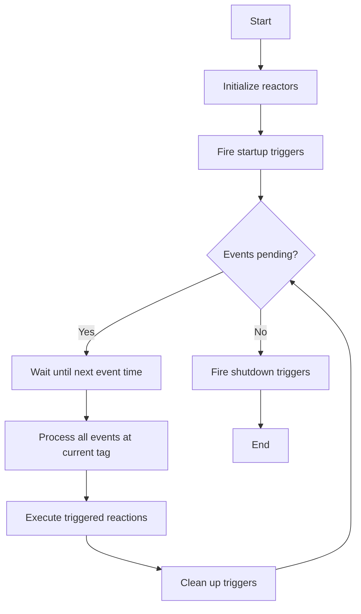
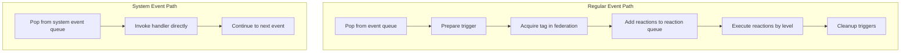
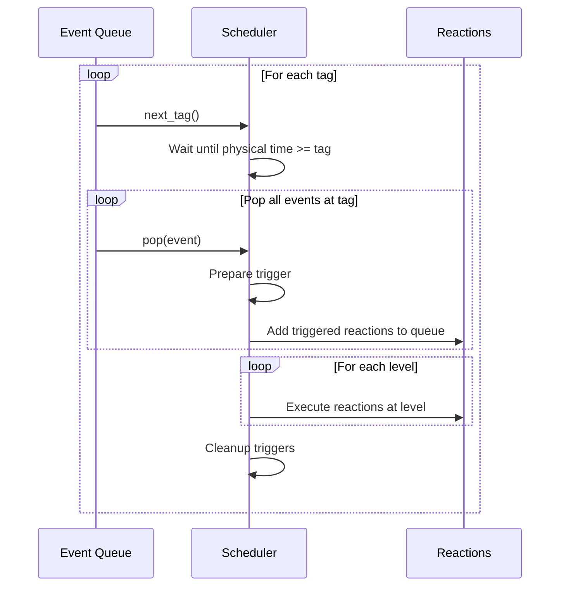

# Scheduling and Execution

This page explains how the reactor-uc scheduler executes reactor programs, managing events and ensuring reactions execute in the correct order.

## The Execution Loop

At a high level, reactor program execution follows this pattern:



The scheduler orchestrates this loop, managing the event queue and ensuring reactions execute in the correct order.

## Event Queue

The **event queue** is a priority queue ordered by tags. Events with earlier tags are processed first:

```c
struct EventQueue {
  tag_t (*next_tag)(EventQueue* self);
  lf_ret_t (*insert)(EventQueue* self, AbstractEvent* event);
  lf_ret_t (*pop)(EventQueue* self, AbstractEvent* event);
  // ... implementation details
};
```

The queue is implemented as a **min-heap**, providing O(log n) insertion and O(log n) removal of the minimum element.

```
Event Queue (min-heap by tag):

              (100ms, 0)
             /          \
       (150ms, 0)    (200ms, 0)
       /        \
  (300ms, 0)  (400ms, 0)
```

### Event Types

Two types of events can be queued:

**Regular Events** trigger reactions:

```c
typedef struct {
  tag_t tag;           // When to process
  Trigger* trigger;    // What to trigger
  void* payload;       // Optional data
  tag_t intended_tag;  // For STP violation detection
} Event;
```

**System Events** handle coordination:

```c
typedef struct {
  tag_t tag;
  SystemEventHandler* handler;  // Startup, shutdown, clock sync
} SystemEvent;
```

## System Events

System events are a special event type designed for scheduling system activities that are **unordered with respect to reactor events**. They handle runtime infrastructure coordination rather than application logic.

### Purpose and Sources

System events originate from built-in coordinators that manage federated runtime behavior:

| Coordinator | Purpose | When Used |
|-------------|---------|-----------|
| **StartupCoordinator** | Synchronizes startup across federated participants | Federation initialization |
| **ShutdownCoordinator** | Coordinates graceful shutdown timing | Program termination |
| **ClockSynchronization** | Exchanges timestamp data for distributed clock sync | Continuous during federation |

Each coordinator extends `SystemEventHandler` and schedules events through the dedicated system event interface:

```c
struct SystemEventHandler {
  void (*handle)(SystemEventHandler* self, SystemEvent* event);
  PayloadPool* payload_pool;
};
```

### Separate Event Queue

System events are stored in a **separate queue** from regular events. The scheduler maintains both queues and checks them independently when determining the next event to process.

### Handling Differences

System events follow a fundamentally different execution path than regular events:

| Aspect | Regular Events | System Events |
|--------|----------------|---------------|
| **Queue** | `event_queue` | `system_event_queue` |
| **Scheduling validation** | Extensive checks (past/future/stop tag) | Minimal validation |
| **Handler type** | `Trigger*` with `prepare()` function | `SystemEventHandler*` with `handle()` function |
| **Tag acquisition** | Waits for `env->acquire_tag()` in federations | Skips tag acquisition entirely |
| **Reaction involvement** | Queues and executes reactions by level | Bypasses reaction system completely |
| **Equal tags** | Prioritized over system events | Processed after regular events |

### Scheduler Processing Logic



When both queues have pending events, the scheduler compares their next tags:

```c
next_tag = event_queue->next_tag();
next_system_tag = system_event_queue->next_tag();

// Handle lower tag first; if equal, prioritize normal events
if (lf_tag_compare(next_tag, next_system_tag) > 0) {
  // Process system event
  Scheduler_pop_system_events_and_handle(self, next_system_tag);
} else {
  // Process regular event with full reaction execution
  // ... prepare triggers, execute reactions, cleanup
}
```

System events are processed by directly invoking their handler without going through the reaction queue:

```c
void Scheduler_pop_system_events_and_handle(Scheduler* self, tag_t tag) {
  do {
    SystemEvent* event;
    system_event_queue->pop(&event);
    event->handler->handle(event->handler, event);
  } while (tag == system_event_queue->next_tag());
}
```

### Why Separate Handling?

System events require different semantics because:

1. **No ordering guarantees needed**: Coordination messages don't need deterministic ordering with application events
2. **No reaction dependencies**: System activities don't participate in the reactor dependency graph
3. **Simpler scheduling**: Infrastructure coordination benefits from minimal overhead
4. **Tag acquisition bypass**: Clock sync and startup messages must arrive before tag acquisition completes

## Reaction Queue

When events fire, they trigger reactions. The **reaction queue** organizes reactions by their topological level:

```c
struct ReactionQueue {
  int* level_size;     // Count of reactions at each level
  int curr_level;      // Currently executing level
  Reaction** array;    // Reactions ordered by level
};
```

Reactions at level 0 execute first, then level 1, and so on. This ensures that if reaction A's output feeds reaction B's input, A executes before B.

```
Level 0: [Reaction A] [Reaction B]
         ────────────────────────
                  │
                  ▼
Level 1: [Reaction C] [Reaction D]
         ────────────────────────
                  │
                  ▼
Level 2: [Reaction E]
```

## Dynamic Scheduler

The **dynamic scheduler** is the default choice for most applications. It processes events as they arrive, sleeping when no events are pending.

### Execution Flow



### Step-by-Step

1. **Get next tag**: Query the event queue for the earliest pending event
2. **Wait**: Sleep until physical time reaches the event's logical time (unless in fast mode)
3. **Pop events**: Remove all events at the current tag from the queue
4. **Prepare triggers**: Call each trigger's `prepare` function to set up state
5. **Collect reactions**: Add triggered reactions to the reaction queue
6. **Execute reactions**: Process reactions level by level
7. **Cleanup**: Call each trigger's `cleanup` function to reset state
8. **Repeat**: Continue until no events remain or shutdown is requested

### Handling Async Events

When physical actions or network messages can arrive asynchronously, the scheduler uses **interruptible waits**:

```c
// Instead of:
platform->wait_until(wakeup_time);

// Use:
platform->wait_until_interruptible(wakeup_time);
```

When an async event arrives:

1. The event source (interrupt handler, network callback) schedules the event
2. The platform's `notify()` function wakes the scheduler
3. The scheduler re-evaluates the next tag and adjusts its wait

This enables responsive handling of external events while maintaining logical time semantics.

## Scheduler Interface

The scheduler implements the following interface:

```c
struct Scheduler {
  bool running;
  interval_t start_time;
  interval_t duration;
  bool keep_alive;

  // Core operations
  void (*run)(Scheduler* self);
  lf_ret_t (*schedule_at)(Scheduler* self, Event* event);
  tag_t (*current_tag)(Scheduler* self);

  // Lifecycle
  void (*prepare_timestep)(Scheduler* self, tag_t tag);
  void (*do_shutdown)(Scheduler* self, tag_t stop_tag);

  // Time control (for testing)
  void (*step_clock)(Scheduler* self, interval_t step);
};
```

## Fast Mode

**Fast mode** skips waiting for physical time to catch up with logical time:

```c
Environment env = {
  .fast_mode = true,  // Don't wait for physical time
  // ...
};
```

This is useful for:

- **Testing**: Run tests as fast as possible
- **Simulation**: Execute faster than real-time
- **Batch processing**: Process recorded data quickly

In fast mode, logical time advances immediately after processing completes, without sleeping.

## Keep Alive

The **keep_alive** flag controls scheduler termination:

```c
Scheduler scheduler = {
  .keep_alive = true,  // Don't stop when queue is empty
  // ...
};
```

With `keep_alive = true`:

- The scheduler waits even when the event queue is empty
- Physical actions can still arrive and be processed
- Useful for servers or long-running reactive systems

With `keep_alive = false`:

- The scheduler stops when no events remain
- Useful for batch processing or finite computations

